# GrainMart — Distributed E-Commerce Platform

**12 Spring Boot microservices** · Next.js storefront · Vue admin · **AWS EKS** (Terraform, Helm, GitHub Actions CI/CD)

Live HTTPS storefront, admin console, and Stripe checkout — Spring Cloud Gateway, Consul, PostgreSQL RDS, Redis, Elasticsearch, and RabbitMQ.

**Repository:** [github.com/Yang-Zhang1994/ecommerce-microservices-backend](https://github.com/Yang-Zhang1994/ecommerce-microservices-backend)

The full stack has been deployed on **AWS EKS** (ALB + HTTPS, three subdomains). **Live demo available on request** — environments are scaled down when idle to control cloud cost.

Screenshots below are from a **local kind + Next.js / Vue dev** run against the same microservices and Oregon RDS schema.

## Screenshots

### Storefront (Next.js)

| Home · Elasticsearch catalog | Product detail · live flash sale |
| --- | --- |
| 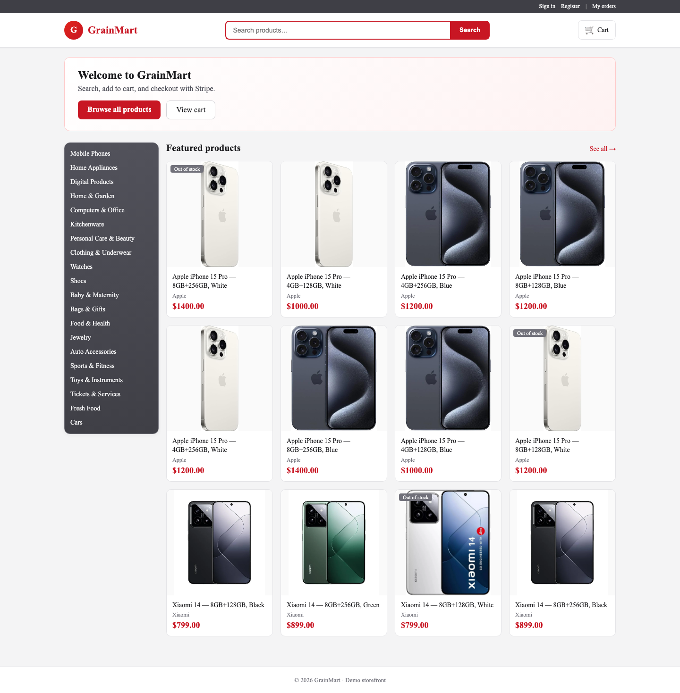 | 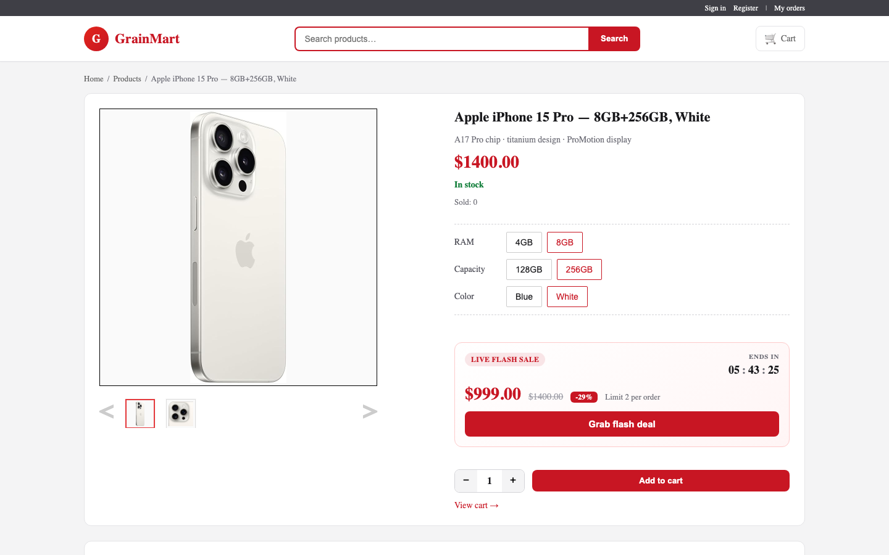  |

| Search | Cart |
| --- | --- |
| 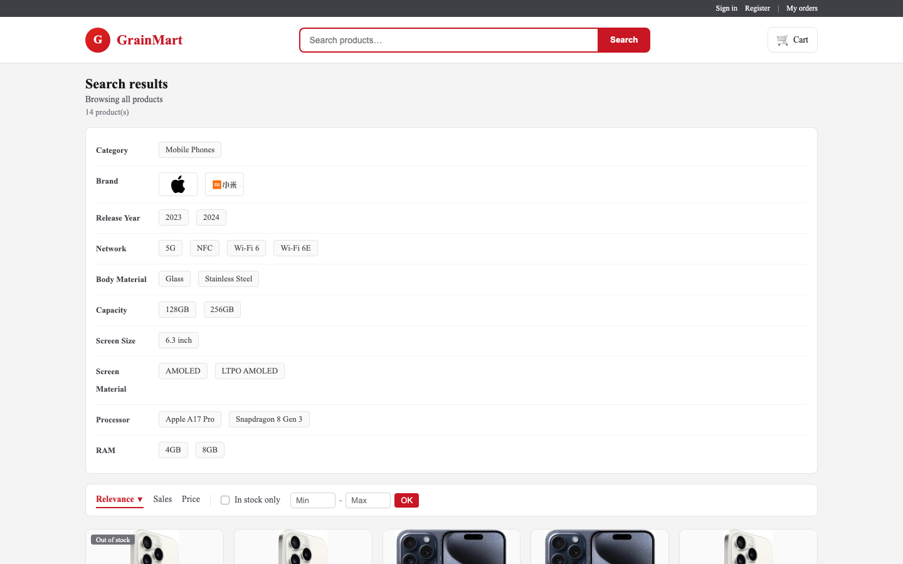 | 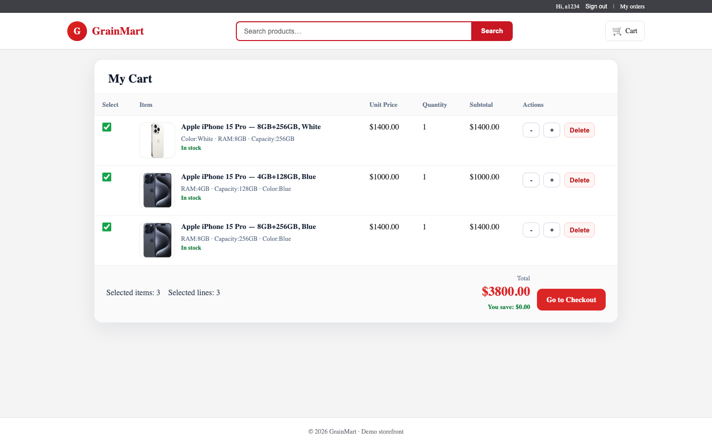 |

| Confirm order | Payment · Stripe cashier |
| --- | --- |
| 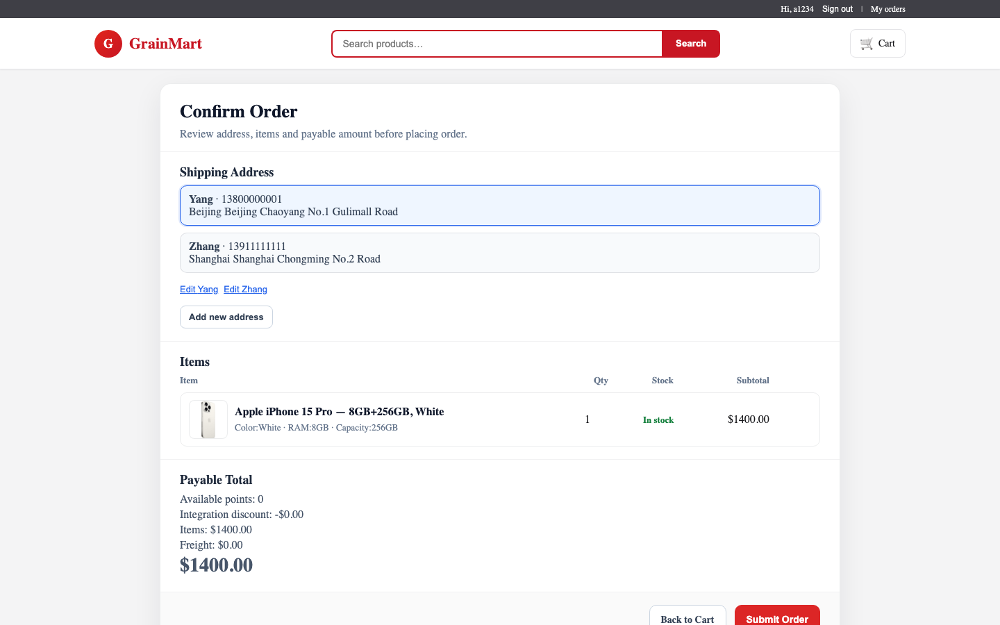 | 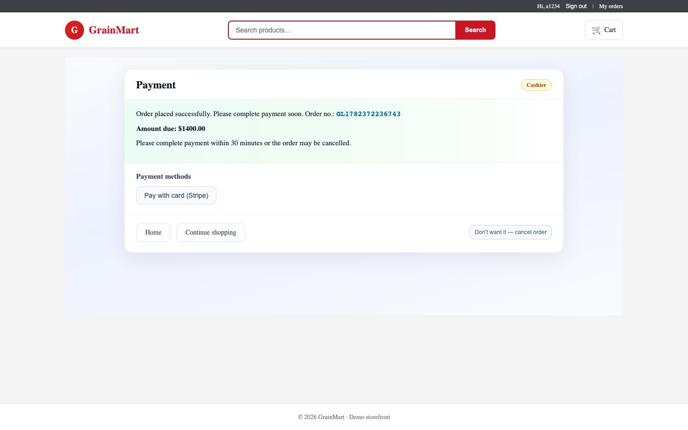 |

### Admin console (Vue + renren-fast)

| Dashboard | Base attributes |
| --- | --- |
| 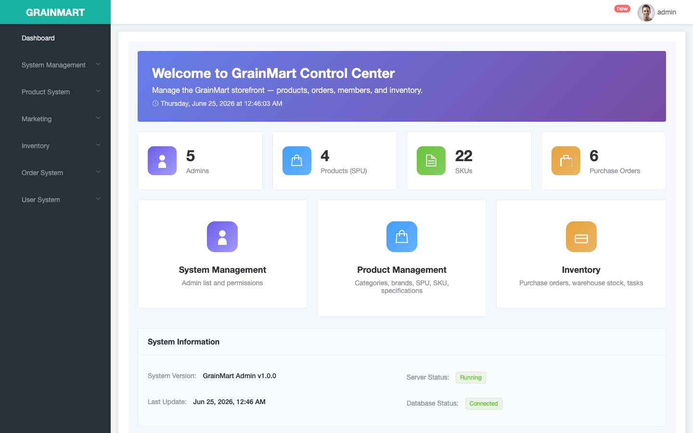 | 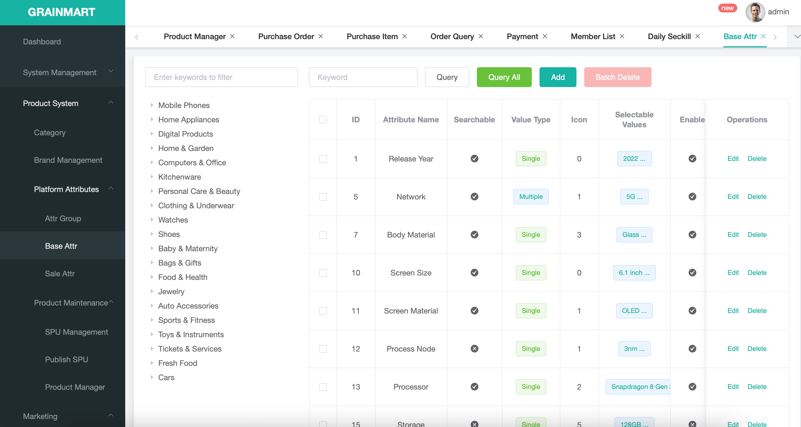 |

| Publish SPU | SPU Management |
| --- | --- |
| 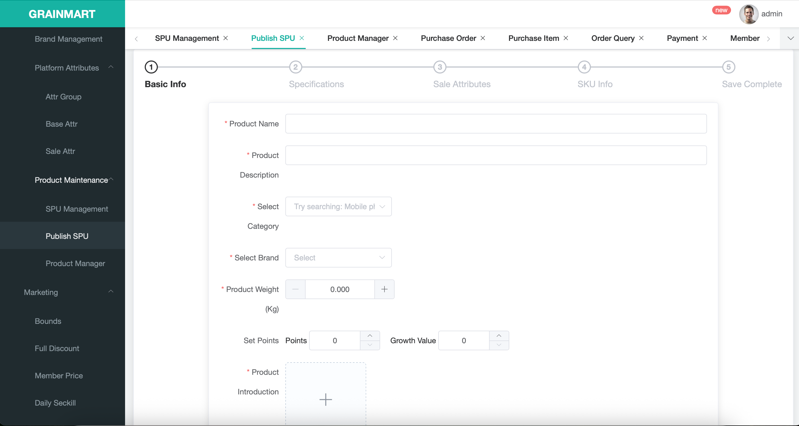 | 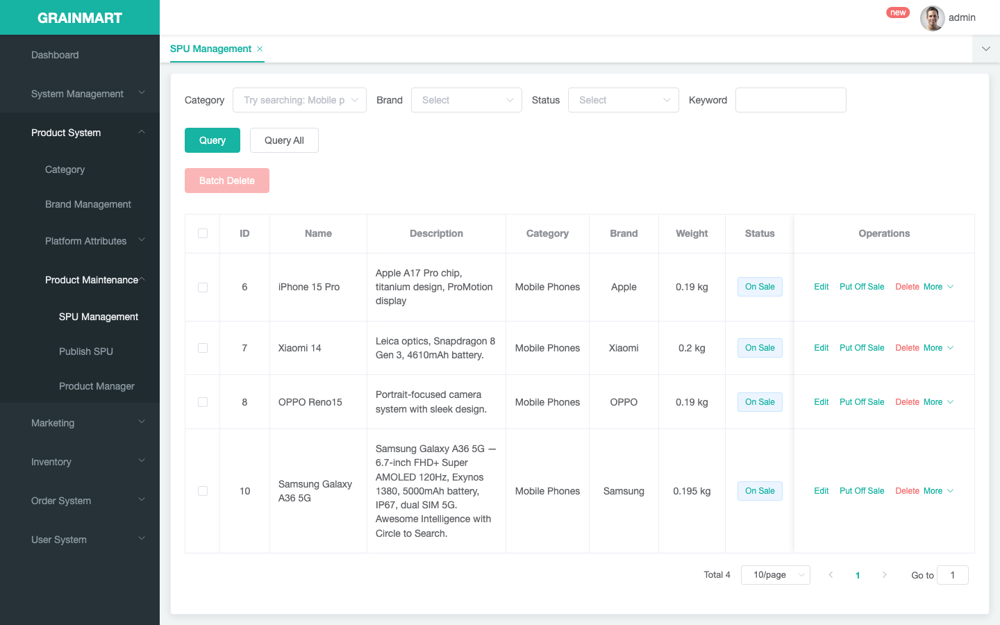 |

| Product manager | Purchase order |
| --- | --- |
| 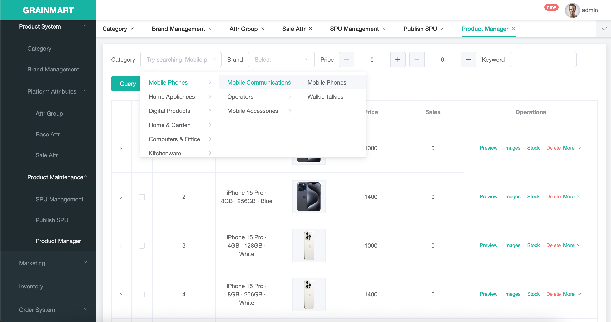 | 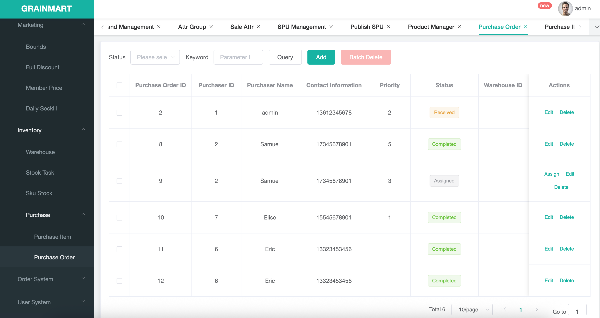 |

Re-capture after UI changes: start [local stack](#option-b--kind--helm), then `cd gulimall-mall && node scripts/capture-readme-screenshots.mjs` (storefront + admin) or `node scripts/capture-checkout-screenshots.mjs` (cart → order → pay).

---

## Overview

| Layer | Components |
|-------|------------|
| **Storefront** | `gulimall-mall` — Next.js 14, Stripe Checkout, Google OAuth2 |
| **Admin** | `renren-fast` (Spring Boot API) + `renren-fast-vue` (Vue 2 + Element UI) |
| **Gateway** | `gulimall-gateway` — Spring Cloud Gateway, single public API entry (ALB + HTTPS) |
| **Business services** | auth, product, member, cart, order, ware, coupon, search, seckill, third-party |
| **Discovery** | Consul |
| **Data** | PostgreSQL on **AWS RDS** (database-per-service), Redis cache-aside, Elasticsearch (catalog search) |
| **Messaging** | RabbitMQ (async order / inventory flows) |
| **Object storage** | AWS S3 presigned uploads via `gulimall-third-party` |
| **Observability** | OpenTelemetry Java agent → Jaeger (local Compose / kind; optional on EKS) |
| **Cloud** | EKS, ECR, ALB + ACM, Route53, Terraform (`infra/terraform`) |

**Inter-service calls:** Spring 6 HTTP Interface (`@HttpExchange`) + load-balanced `RestClient` via Consul.

---

## Tech stack

| Layer | Technology |
|-------|------------|
| Backend | Java 17, Spring Boot 3.2, Spring Cloud 2023 |
| Gateway & discovery | Spring Cloud Gateway, Consul |
| Storefront | Next.js 14, React 18, TypeScript, Playwright E2E |
| Admin UI | Vue 2, Element UI, Vuex |
| Data | PostgreSQL (RDS), Redis, Elasticsearch, MongoDB (admin captcha fallback) |
| Payments & auth | Stripe Checkout + webhooks, Google OAuth2, JWT |
| Infra | Docker, Kubernetes, Helm, Terraform, AWS (EKS, ECR, ALB, S3, RDS) |
| CI/CD | GitHub Actions (JUnit gate → ECR → Helm deploy with OIDC) |
| Load testing | k6 (Gateway / Product HPA scenarios) |

---

## Project structure

```
├── gulimall-common          # Shared DTOs, cache helpers, HTTP clients
├── gulimall-gateway         # API gateway
├── gulimall-auth-server     # OAuth2 / social login
├── gulimall-product         # Catalog, categories, SKUs
├── gulimall-member          # Users, addresses, levels
├── gulimall-cart            # Shopping cart
├── gulimall-order           # Orders, Stripe payment, idempotency
├── gulimall-ware            # Inventory, stock locks (RabbitMQ)
├── gulimall-coupon          # Promotions
├── gulimall-search          # Elasticsearch product search
├── gulimall-seckill         # Flash sale
├── gulimall-third-party     # S3 presigned URL upload
├── gulimall-mall            # Next.js storefront
├── renren-fast              # Admin backend (Spring Boot)
├── renren-fast-vue          # Admin frontend (Vue)
├── k8s/helm/gulimall        # Umbrella Helm chart (kind + EKS values)
├── infra/terraform          # VPC, EKS, ECR, ALB, OIDC for GitHub Actions
├── docker-compose.app.yml   # Full local stack (Consul, Redis, RabbitMQ, Jaeger, all services)
└── docs/                    # EKS, CD, load test, domain setup
```

---

## Quick start (local)

### Prerequisites

- JDK 17, Maven 3.8+, Docker & Docker Compose
- PostgreSQL (local or RDS endpoint in `.env`)
- Node.js 18+ (storefront / admin UI)

### Option A — Docker Compose (recommended)

```bash
cp .env.example .env          # set RDS_* or local DB credentials
mvn clean package -DskipTests
docker compose -f docker-compose.app.yml up -d --build
```

- Storefront + Nginx: http://localhost  
- Gateway API: http://localhost:88 (or via Nginx `/api`)  
- Jaeger UI: http://localhost:16686  
- Consul: http://localhost:8500  

Elasticsearch (optional, for search): `docker compose -f docker-compose.es.yml up -d`

### Option B — kind + Helm

```bash
./k8s/scripts/kind-up.sh
./k8s/scripts/k8s-create-secrets.sh
./k8s/scripts/kind-deploy.sh
```

Gateway: http://localhost:3088 — see [docs/EKS.md](docs/EKS.md).

### Option C — IDE / manual

1. `docker compose up -d` (Consul only)  
2. `mvn clean install -DskipTests`  
3. Start gateway → services → `renren-fast`  
4. Admin UI: `cd renren-fast-vue && npm install && npm run dev`  
5. Mall: `cd gulimall-mall && npm install && npm run dev` (set `NEXT_PUBLIC_API_BASE`)

---

## Production (AWS EKS)

| Step | Command / doc |
|------|----------------|
| Provision cluster | `infra/terraform` with `enable_eks=true` — [docs/EKS.md](docs/EKS.md) |
| Push images | `./k8s/scripts/ecr-push-all.sh` (12 services + renren-fast) |
| Deploy | `./k8s/scripts/eks-up.sh` or Helm `values-eks.yaml` |
| CI/CD | Push to `main` → [docs/CD.md](docs/CD.md) |
| Scale idle nodes | `./k8s/scripts/eks-down.sh` — [docs/EKS.md](docs/EKS.md) |

Domains (Route53 + ACM):

| Host | Purpose |
|------|---------|
| `www.yangzhangtech.online` | API gateway (ALB Ingress) |
| `mall.yangzhangtech.online` | Next.js storefront |
| `admin.yangzhangtech.online` | Vue admin console |

---

## Testing

| Type | Where | Notes |
|------|-------|-------|
| Unit tests (9) | `gulimall-common`, `gulimall-order` | CI gate on PR / push — `.github/workflows/ci.yml` |
| Playwright E2E | `gulimall-mall/e2e/` | Stripe checkout smoke |
| API purchase flow | `k8s/scripts/e2e-order-a1234.sh` | 10-step order validation |
| Load test | `k8s/scripts/load-test/` | k6 ~36 RPS on search path — [docs/load-test.md](docs/load-test.md) |

```bash
mvn -pl gulimall-common,gulimall-order -am test \
  -Dtest=ProtectedCacheTest,IdempotencyServiceTest,OrderWorkflowServiceImplTest,StripePaymentServiceImplTest
```

---

## Configuration

Credentials are **not** committed. Copy `.env.example` → `.env` for local / deploy scripts.

| Variable | Purpose |
|----------|---------|
| `SPRING_DATASOURCE_*` | Per-service PostgreSQL |
| `RDS_*` | Shared RDS host (scripts, admin demo user) |
| `ORDER_STRIPE_*` | Stripe secret + webhook |
| `GOOGLE_CLIENT_ID` / `SECRET` | OAuth2 login |
| `AWS_ACCESS_KEY_ID` / `SECRET` | S3 uploads (or use IAM role on EKS) |

Optional AWS config sources: Secrets Manager and SSM Parameter Store (`optional:aws-secretsmanager:…` in service YAML). Services start without AWS for local dev.

`application-local.yml` is gitignored — use profile `local` for machine-specific overrides.

---

## Documentation

| Doc | Topic |
|-----|--------|
| [docs/EKS.md](docs/EKS.md) | kind + EKS deploy, secrets, domains |
| [docs/CD.md](docs/CD.md) | GitHub Actions → ECR → Helm, OIDC setup |
| [docs/load-test.md](docs/load-test.md) | k6 scenarios, HPA, baseline results |
| [docs/DOMAIN_ACCESS_SETUP.md](docs/DOMAIN_ACCESS_SETUP.md) | Multi-domain routing |
| [docs/MALL_HOMEPAGE_NEXTJS.md](docs/MALL_HOMEPAGE_NEXTJS.md) | Storefront setup |

---

## License

Apache-2.0 — see [LICENSE](LICENSE).
